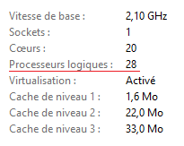

# README: PENELOPE-multithreading-python-script

Ce est conçu pour exécuter en parallèle plusieurs instances du programme `penmain.exe` en divisant une tâche initiale entre différents threads. Chaque instance génère des fichiers de résultats, qui sont ensuite fusionnés en un fichier unique. Ce script à été concu et testé sur Windows 10 et peut ne pas fonctionner sous un autre programme d'exploitation.

## Structure du Script

Le script est organisé en plusieurs fonctions :

1. **`run_penmain(command, directory, number)`**  
   Cette fonction exécute `penmain.exe` dans un dossier spécifique pour un thread donné, affiche la sortie en temps réel et renvoie les messages d’erreurs le cas échéant.

2. **`modify_nparticles(dir, number_thread, n, input_file)`**  
   Cette fonction divise le nombre de particules spécifié dans le fichier d'entrée entre les différents threads pour éviter que chaque exécution ne simule l'ensemble des particules initiales. Le nombre de particules est réparti de manière égale entre les threads.

3. **`fuse(file_paths, output_file, columns_to_add)`**  
   Cette fonction fusionne les fichiers de résultats générés par chaque thread dans un fichier unique en additionnant les colonnes spécifiées (ici, les colonnes 2 et 3). Les lignes de commentaires des fichiers d'origine sont conservées dans le fichier fusionné.

4. **`create_directories(num_threads, original_directory, input_file)`**  
   Cette fonction crée des copies du dossier d'origine (qui contient `penmain.exe` et le fichier d'entrée) pour chaque thread, tout en modifiant le nombre de particules à simuler dans chaque copie.

5. **`run_thread(command, original_directory, num_threads, input_file)`**  
   Cette fonction principale configure les threads, crée les copies de dossiers nécessaires, exécute `penmain.exe` pour chaque thread, puis fusionne les fichiers de résultats des différents threads dans un fichier de sortie unique.

## Utilisation du Script

### Prérequis

- Placez `penmain.exe` et le fichier d'entrée `input.in` dans le dossier de base spécifié.
- Assurez-vous que la version de Python utilisée supporte la bibliothèque `concurrent.futures` (version 3.2 ou plus récente).
- Vérifier les capacités de votre processeur. Par défaut, Penelope execute ses taches sur 2 processeur logique. S'assurer d'avoir au moins 4 processeur logique allouable uniquement à son execution. Pour des raisons de performance et afin de ne pas faire surchauffer ou endommager la machine, il est conseillé de produire un nombre de thread inférieur à 75% des processeur logique pour une utilisation à plein régime.

### Structure des Fichiers et Dossiers

Le fichier d'entrée doit contenir "penmain.exe" ainsi que tout les fichiers nécessaire à son execution.

### Instructions

1.  **Vérifier le nombre de processeur logique du processeur**
    Le raccourci *CTRL + SHIFT + ECHAP* permets d'ouvrir le gestionnaire des tâches. Sous l'onglet "Perfomances" le nombre de processeur logique est affiché. Il est hautement conseillé de ne pas dépasser 75% de cette valeur.

    
2.  **Définissez les paramètres principaux** dans le code avant exécution :
   - `input_file` : Nom du fichier d'entrée (par défaut `input.in`).
   - `directory` : Dossier contenant `penmain.exe` et les autres fichiers nécessaires.
   - `threads` : Nombre de threads (copies du dossier) à produire.

3. **Exécutez le script** en ligne de commande ou avec un éditeur Python.

### Explication des Paramètres

- `input_file` : Nom du fichier d'entrée contenant les paramètres de simulation.
- `command` : Commande pour exécuter `penmain.exe`.
- `directory` : Emplacement du dossier contenant le fichier d'entrée et `penmain.exe`.
- `threads` : Nombre de threads (ou processus parallèles) à lancer.

  

### Fonctionnement du Script

1. **Création des copies de dossiers** :  
   Chaque thread possède sa propre copie du dossier d'origine pour éviter les conflits de fichiers pendant l'exécution.

2. **Modification du fichier d'entrée** :  
   Le nombre de particules (`NSIMSH`) est réparti uniformément entre les threads pour que chaque copie n'exécute qu'une partie de la simulation.

3. **Exécution de `penmain.exe` en parallèle** :  
   Chaque thread exécute sa propre instance de `penmain.exe`.

4. **Fusion des résultats** :  
   Après l'exécution, les fichiers `depth-dose.dat` de chaque thread sont fusionnés en un seul fichier dans le dossier d'origine.

## Modulabilité et gestion des Erreurs

Le code est entièrement commenté et prends en compte la gestion des erreurs. Ces dernières peuvent être facilement retrouvées dans la documentation. Dans le cas d'une erreur propre au script, merci de me contacter

---

## Remarques

Ce script n'est actuellement conçu uniquement pour la dose en profondeur. Toute autre grandeur doit être recombinée manuellement.
Ce script est conçu pour un usage interne et nécessite une certaine configuration initiale, mais il est optimisé pour gérer des simulations en parallèle tout en centralisant les résultats dans un fichier final.

## Avertissement Légal

**Penelope** est un logiciel tiers soumis aux droits d'auteur de son propriétaire original, et n'appartient ni n'est affilié à l'auteur de ce script ou aux collaborateurs de ce projet. Ce script est uniquement conçu pour faciliter l'exécution et le traitement des données produites par **Penelope** dans un contexte académique ou de recherche. Toute utilisation de **Penelope** dans le cadre de ce script doit être conforme aux termes de licence et aux droits d'auteur du propriétaire original du logiciel.

Les utilisateurs sont responsables de s'assurer que l'utilisation de **Penelope** est autorisée dans leur contexte spécifique et que toute diffusion, modification ou utilisation du logiciel respecte les réglementations en vigueur. Ce script ne constitue en aucun cas une modification du logiciel **Penelope** lui-même, mais propose des fonctions d'automatisation et de traitement des données en dehors du cadre de l'application originale. 

En utilisant ce script avec **Penelope**, vous reconnaissez que vous respecterez les conditions d'utilisation et de licence de **Penelope** et dégagez de toute responsabilité l'auteur de ce script pour toute utilisation en dehors de ce cadre légal.

Ce script a été conçu et testé sous Windows 22H2 avec un processeur Intel(R) Core(TM) I7-14700F. L'auteur de ce script n'est en aucun cas responsable de son utilisation sur tout autre appareil. 

